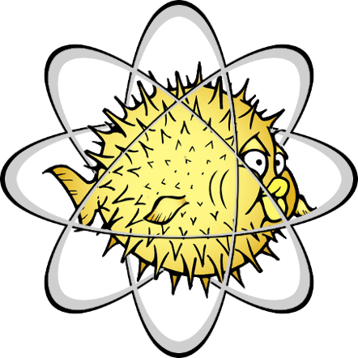

isotop
==========

OpenBSD easier to explore and use.

Available from OpenBSD > 6.5

isotop is a script to configure OpenBSD and make it great for desktop.

Installation
------------
Install OpenBSd, then :

	ftp https://framagit.org/3hg/isotop/raw/master/src/isotop.sh
	sh isotop.sh

Help
----

Read ``man isotop``.

Or see these pages : 

- [FAQ en](https://3hg.fr/Isos/isotop/isotop.man.html)
- [FAQ fr](https://3hg.fr/Isos/isotop/isotop-fr.man.html)

