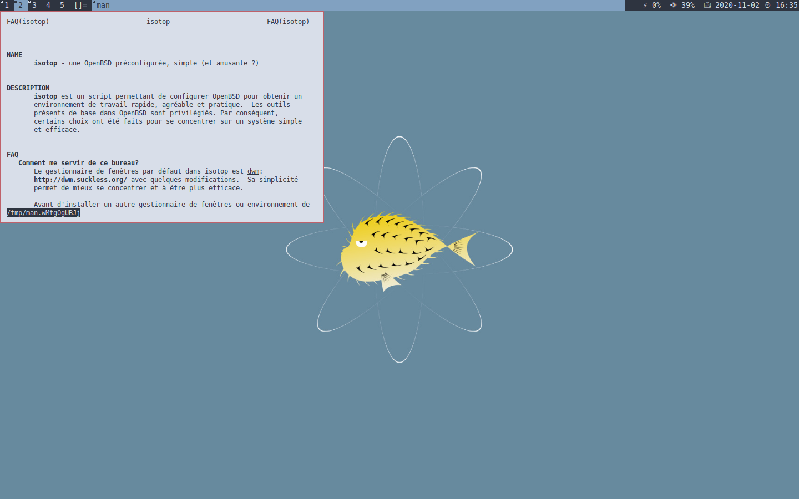

# isotop

isotop is a set of configuration files, translations and instructions to
make OpenBSD great for desktop.

Available from OpenBSD > 6.5

It is splitted in two separate scripts : 

- `isotop-user.sh` : configure user session.
- `isotop-root.sh` : require root privileges, install ports and
configure system daemons.

## Installation

Install OpenBSD. See
[intructions](https://www.openbsd.org/faq/faq4.html).

Download isotop last archive and checksum

	$ ftp https://framagit.org/3hg/isotop/raw/master/isotop-$VERSION.tgz
	$ ftp https://framagit.org/3hg/isotop/raw/master/isotop-$VERSION.sha256
	$ sha256 -C isotop-$VERSION.sha256 isotop-$VERSION.tgz

If OK, extract archive and run scripts : 

	$ tar xvzf isotop-$VERSION.tgz
	$ sh isotop-user.sh
	$ su root isotop-root.sh

When you have finished, feel free to remove every `isotop-*` files.

Screenshots
-----------

